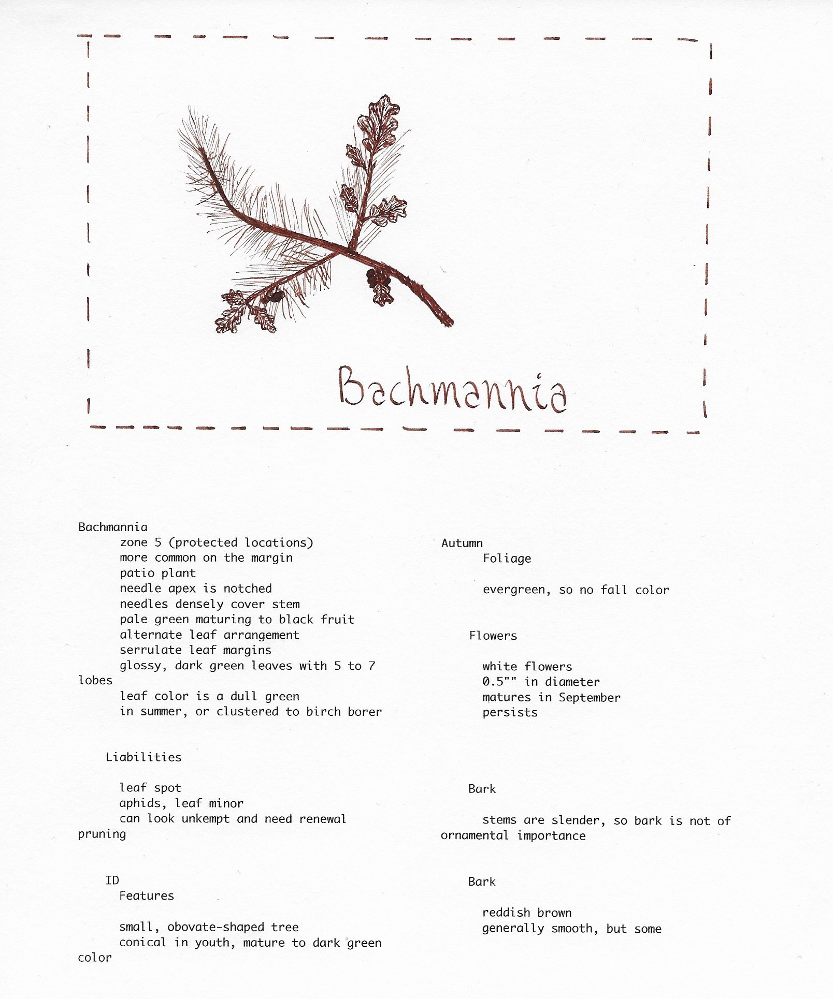

# Project 1 Generative Text: "Imagined Ecology"

Jake Bauer, jjbauer@ucsd.edu

## Abstract

The motive behind this project was to generate descriptions of plants--and that's exactly what it does! The results aren't very 'scientific'... as anyone could easily tell that these plants often have contradictory profiles. However, this project is optimal for describing new forms of life for artists to render, or for new-ish artists like me to practice drawing imaginative flora. I must admit, most of my efforts in this project was trying, and retrying over and over to find, parse, or scrape a set of training data that provided suitable results. I started of using books and encyclopedias from open sources websites like the gutenberg collection, however (after getting awful results with the more formal texts) I eventually found that web-scraping horti.uconn.edu worked wonders. I used an RNN with only slight modifications from the baseline, training it on this data I scraped. With the improved data, I got great results. Adding in the feature of randomizing the initial-state from a massive set of plant genuses helped hone my results. Improvements to make in the future could be making templates (ie. forcing the generator to have an ordered list of traits), or creating a separate neural network to generate the names rather than just randomization (which could help with overfitting).

## Files

Briefly decribe the files that are included with your repository:
- Imagined_Ecology.ipynb
  Jupyter Notebook with code to setup, train, and generate plant descriptions!
- plant-data-final-encoded.txt
  The set of training data that the above notebook utilizes
- names.csv
  A csv file containing thousands of web-scraped plant genus names--used as the initial state of the RNN to generate better 'plant profiles'
  

## Results

- typical-output.txt
  Contains a large amount of generated 'plant profiles'--represents the typical textual output
  
## Notes
- Because Imagined_Ecology.ipynb writes the output to a file, you will need to create a .txt file called "100-generated-plants.txt" in the same directory as the rest of the notebooks.

- Artistic renditions made by myself, Jake Bauer. [Ink on cardstock, italic nib]

## Reference

Project requirements: [doc](https://docs.google.com/document/d/13ueceIyuUc4ATD7B-SFZK641MycFZ57eZ9n1lQ3Y1CM/edit?usp=sharing)
